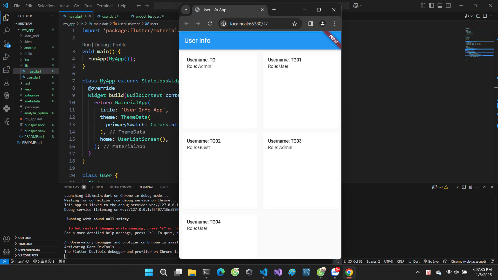
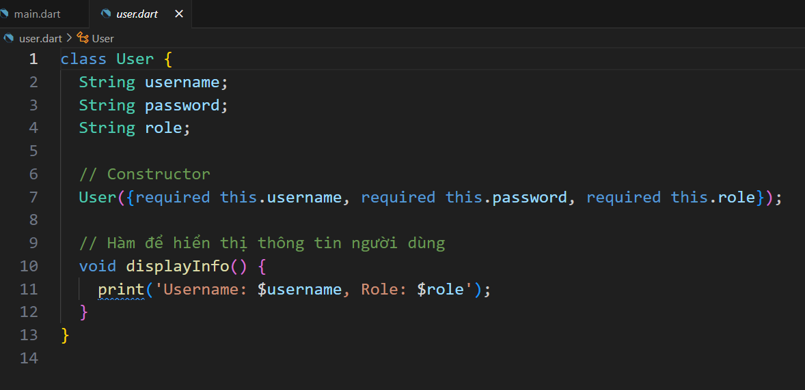

# Ứng dụng Thông tin Người dùng

Đây là một ứng dụng Flutter đơn giản hiển thị danh sách thông tin người dùng dưới dạng lưới. Mỗi người dùng có tên đăng nhập, mật khẩu và vai trò, được hiển thị trên màn hình chính của ứng dụng.

## Tính năng

- Hiển thị danh sách người dùng dưới dạng lưới.
- Mỗi thẻ người dùng hiển thị tên đăng nhập và vai trò.

## Giao diện 



## Class User



## Tổng quan về Mã nguồn

### Hàm chính

Điểm bắt đầu của ứng dụng là hàm `main` gọi `runApp` với tham số là `MyApp`.

```dart
void main() {
  runApp(MyApp());
}
```

### Lớp MyApp

`MyApp` là một `StatelessWidget` thiết lập MaterialApp với tiêu đề và chủ đề. Nó cũng định nghĩa `UserListScreen` là màn hình chính.

```dart
class MyApp extends StatelessWidget {
  @override
  Widget build(BuildContext context) {
    return MaterialApp(
      title: 'User Info App',
      theme: ThemeData(
        primarySwatch: Colors.blue,
      ),
      home: UserListScreen(),
    );
  }
}
```

### Lớp User

Lớp `User` đại diện cho một người dùng với ba thuộc tính: `username`, `password`, và `role`. Nó sử dụng một hàm khởi tạo có tên để khởi tạo các thuộc tính này.

```dart
class User {
  String username;
  String password;
  String role;

  User({required this.username, required this.password, required this.role});
}
```

### Lớp UserListScreen

`UserListScreen` là một `StatelessWidget` hiển thị lưới các thẻ người dùng. Nó khởi tạo danh sách năm đối tượng `User`, mỗi đối tượng có vai trò và thông tin đăng nhập khác nhau.

```dart
class UserListScreen extends StatelessWidget {
  final List<User> users = [
    User(username: 'TG', password: 'pass1', role: 'Admin'),
    User(username: 'TG01', password: 'pass2', role: 'User'),
    User(username: 'TG02', password: 'pass3', role: 'Guest'),
    User(username: 'TG03', password: 'pass4', role: 'Admin'),
    User(username: 'TG04', password: 'pass5', role: 'User'),
  ];

  @override
  Widget build(BuildContext context) {
    return Scaffold(
      appBar: AppBar(title: Text('User Info')),
      body: GridView.builder(
        gridDelegate: SliverGridDelegateWithFixedCrossAxisCount(
          crossAxisCount: 2,
        ),
        itemCount: users.length,
        itemBuilder: (context, index) {
          return Card(
            margin: EdgeInsets.all(8),
            child: Padding(
              padding: const EdgeInsets.all(16.0),
              child: Column(
                crossAxisAlignment: CrossAxisAlignment.start,
                children: [
                  Text('Username: ${users[index].username}', style: TextStyle(fontWeight: FontWeight.bold)),
                  SizedBox(height: 4),
                  Text('Role: ${users[index].role}'),
                ],
              ),
            ),
          );
        },
      ),
    );
  }
}
